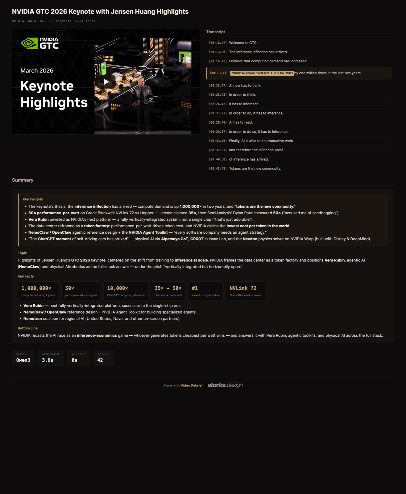

# Video Debrief


**Don't watch the video — have it summarized.**

*🇩🇪 Deutsche Version: [README.de.md](README.de.md)*

Video Debrief turns any video — webinar, ad, tutorial, your own recording — into a
**summary** plus a searchable **timeline** built from transcript and image
descriptions, in minutes. You skip the watching and still keep everything: every
number, every on-screen text, every cut.

**Why it's different:**
- **100% local** — no cloud upload, no forced API. Your material never leaves your machine.
- **Cleans up after itself** — deletes the downloaded video + frames after analysis; only the report stays.
- **Any backend** — Ollama, LM Studio or oMLX via one OpenAI-compatible endpoint. macOS, Linux, Windows.
- **Agent-native** — a Claude Code skill (`/debrief <url>`), plus a standalone Python pipeline.

And the best part: **it all runs locally.** No cloud upload, no forced API, no
third-party servers. A local vision model describes the frames, Whisper transcribes
the audio, your agent writes the summary. Your material stays on your machine.

Video Debrief is a **skill for Claude Code** (also runs in Cursor and other agentic
systems) — and the Python pipeline works just as well standalone in the terminal.



<sub>A 4:41 NVIDIA GTC 2026 keynote → summary, key facts and a searchable transcript timeline. **[▶ Open the interactive report](https://htmlpreview.github.io/?https://github.com/starks-design/video-debrief/blob/main/examples/example-report.html)** (served over http, so the player runs inline).</sub>

---

## What it does (4 local stages)

1. **Download / Locate** — `yt-dlp` fetches the video (URL) or takes your local file.
2. **Scene detection** — `ffmpeg` finds every hard cut plus heartbeat frames in long static passages.
3. **Transcript** — auto-captions, `whisper.cpp` or `faster-whisper` (your choice).
4. **Vision** — a local vision model describes every scene frame in 5 sentences, including OCR.

Result: `report.html` (player + clickable timeline + insight markers + summary)
and `debrief_result.json` (all raw data). Example: `examples/example-report.html`.

---

## Quick start (with an agent — recommended)

Drop **`INSTALL.md`** into your agent (Claude Code or similar). It detects your OS,
checks the tools, finds your local LLM backend, picks a vision model, and writes
the `debrief.config.json`. Then:

```
/debrief https://www.youtube.com/watch?v=…
```

or directly:

```bash
python3 scripts/debrief.py "https://www.youtube.com/watch?v=…"
python3 scripts/debrief.py "/path/to/my-video.mp4"
```

---

## Manual setup

### 1. ffmpeg + yt-dlp (required)

Scene detection, frame extraction and audio need **ffmpeg/ffprobe**; the download
needs **yt-dlp**.

| OS | Command |
|----|---------|
| macOS | `brew install ffmpeg yt-dlp` |
| Linux (Debian/Ubuntu) | `sudo apt install ffmpeg` · `pipx install yt-dlp` |
| Windows | `winget install Gyan.FFmpeg yt-dlp.yt-dlp` (or `choco install ffmpeg yt-dlp`) |

Test: `ffmpeg -version` · `ffprobe -version` · `yt-dlp --version`.

### 2. Scene detection (no extra tool — just context)

Video Debrief extracts a frame at every detected cut, controlled by
`scene.threshold` in the config (default `0.3`):

- **Too few frames?** (cut-sparse talking heads/slides) → lower the threshold, e.g. `0.2`, or via flag: `--scene-threshold 0.2`.
- **Too many frames?** (very cut-heavy) → raise the threshold (`0.4`–`0.5`) or set `--max-frames 80`.
- `scene.heartbeat_seconds` (default `30`) additionally forces a frame every N seconds in long static passages, so nothing slips through.

### 3. Transcript — three ways

Set `whisper.mode` in the config:

- **`auto`** (default) — for URLs, auto-captions first (`yt-dlp`, free, instant); no captions or a local file → fallback to `whisper.cpp`.
- **`captions`** — auto-captions only. Best-effort, depends on whether the video has any. For reliable transcripts in any language use `whisper`.
- **`whisper`** — [whisper.cpp](https://github.com/ggml-org/whisper.cpp). Install `whisper-cli` and a ggml model, then set the path in `whisper.model_path`:
  ```bash
  brew install whisper-cpp          # macOS; Linux/Windows: see the whisper.cpp README
  # download a ggml model, e.g. large-v3-turbo, and set the path in the config:
  #   "whisper": { "mode": "whisper", "model_path": "/path/ggml-large-v3-turbo.bin" }
  ```
- **`faster-whisper`** — pure pip package, no C build:
  ```bash
  pip install faster-whisper
  # "whisper": { "mode": "faster-whisper", "model_path": "large-v3" }
  ```

### 4. Vision backend (local LLM)

Video Debrief talks to any **OpenAI-compatible** chat API. Set the endpoint and
model in `vision`. Three common backends:

| Backend | `vision.base_url` | `vision.backend` |
|---------|-------------------|------------------|
| **Ollama** (default) | `http://localhost:11434/v1/chat/completions` | `ollama` |
| **LM Studio** | `http://localhost:1234/v1/chat/completions` | `lmstudio` |
| **oMLX** (Apple Silicon) | `http://localhost:8000/v1/chat/completions` | `omlx` |

> **Apple Silicon tip:** Ollama runs vision models over Metal. For MLX-accelerated
> vision (noticeably faster on M-series), use **oMLX** or LM Studio's MLX runtime —
> Ollama's MLX backend (0.19+) currently accelerates text models only.

Set a **vision-capable** model as `vision.model` (Qwen-VL or Gemma-Vision family).
List the tags your backend knows:

```bash
curl -s http://localhost:11434/api/tags          # Ollama
curl -s http://localhost:1234/v1/models           # LM Studio
```

> **Verification note:** This pipeline was tested live against **oMLX**. Ollama and
> LM Studio use the same OpenAI-compatible interface and are documented, but **not
> live-verified** — exact model tags vary by installed version, so check them via
> the endpoints above.

If your backend needs an API key, put it in an ENV variable and set the **name** of
that variable in `vision.api_key_env` (e.g. `"OPENAI_API_KEY"`). Video Debrief reads
the key at runtime from the ENV — it never lands in a file.

### 5. Insights & summary

- `insights` uses the same (or another) local LLM to pull 10–15 key statements with timestamps. Disable via `"insights": { "enabled": false }`.
- `summary.engine`:
  - **`host-agent`** (default) — the pipeline drops a ready-made prompt as `SUMMARY_TODO.md`; your agent (Claude Code) writes the summary into the report. Best quality, no extra model needed.
  - **`local-llm`** — the pipeline calls an LLM itself (`summary.base_url` / `summary.model`). For standalone use without an agent.
  - **`none`** — no summary.

### 6. Cleanup — what stays after analysis (privacy)

Video Debrief **deletes the downloaded video and the extracted frame images after
analysis** — all that stays is the report (`report.html`) and the raw data
(`debrief_result.json`). That's by design: nothing heavy is left lying around, and
sensitive material disappears from disk as soon as it's analyzed.

- Controlled by `cleanup.delete_video` and `cleanup.delete_frames` (both default **on**).
- For **YouTube URLs** the report needs no local video file: served over a server / your dashboard (`http`) it plays inline with a synced transcript; on double-click (`file://`, where YouTube blocks embeds) it shows the thumbnail, whose timeline clicks open the video on YouTube at the given second.
- For **local files** your original stays untouched (it's never copied); the report then notes that the working video was deleted — the timeline still works.
- Want to keep video/frames (e.g. for debugging)? Set the flags to `false`.

---

## Config reference

Copy `debrief.config.example.json` to `debrief.config.json` and adjust.
Lookup order: `$DEBRIEF_CONFIG` → `./debrief.config.json` → `~/.debrief/config.json`.

| Key | Meaning |
|-----|---------|
| `output_dir` | Where reports are written (default `./debrief-output`) |
| `vision.base_url` / `.model` / `.backend` / `.api_key_env` | Vision endpoint, model, backend type, ENV name of the key |
| `vision.context_window` | How many previous frame descriptions to pass as context (drift avoidance), default 2 |
| `insights.*` | Endpoint/model/key for the insight LLM · `enabled` |
| `whisper.mode` / `.bin` / `.model_path` / `.language` | Transcript mode + whisper.cpp binary/model + language (`auto`) |
| `summary.engine` / `.base_url` / `.model` | `host-agent` \| `local-llm` \| `none` |
| `relevance.enabled` / `.profile` | Optional "relevance for you" block + your profile |
| `branding.footer` | Subtle "Made with Video Debrief" footer in the report (default `true`) |
| `scene.threshold` / `.heartbeat_seconds` / `.max_frames` | Scene-detection tuning |
| `cleanup.delete_video` / `.delete_frames` | Delete video + frames after analysis (default **on**) — only report + JSON stay |

---

## Troubleshooting

| Problem | Fix |
|---------|-----|
| `ffmpeg/ffprobe not found` | install ffmpeg (see above) |
| Scene detection returns 0 frames | lower `scene.threshold` (`0.2`) |
| Vision response empty / error | backend running? `vision.base_url` correct? model vision-capable + pulled? |
| `whisper-cli not in PATH` | set `whisper.mode` to `captions`/`faster-whisper`, or install whisper.cpp |
| Summary missing from report | check `summary.engine`? With `host-agent`: have `SUMMARY_TODO.md` processed |

---

## License & origin

Apache License 2.0 (see `LICENSE`) — free to use, including commercially, as long
as the copyright and `NOTICE` are preserved; the "Starks.Design" trademark is
excluded. Built by **[Starks.Design](https://starks.design)**. If Video Debrief
helps you: keep the subtle footer in the report — or turn it off via
`branding.footer: false`. No strings attached.
